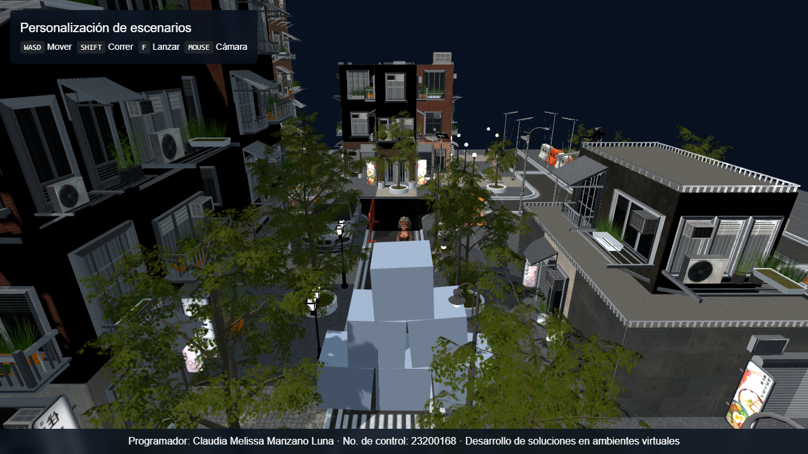
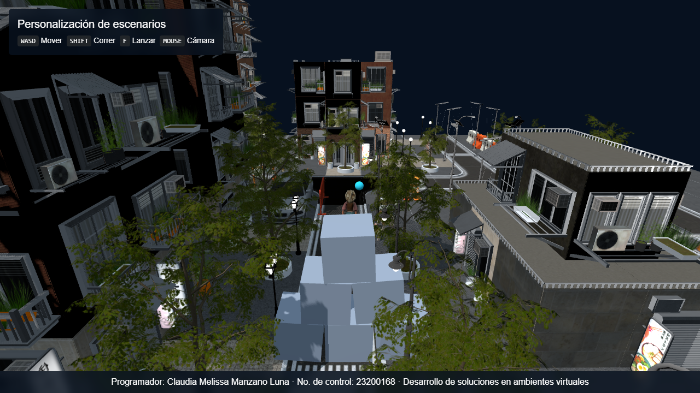

# Instituto Tecnológico Nacional de México
### Campus Pachuca

**Desarrollo de soluciones en ambientes virtuales**

## 1.5 Personalización de escenarios

**Docente:** Ing. Víctor Manuel Pinedo Fernández
**Alumna:** Manzano Luna Claudia Melissa — No. de control 23200168
**Fecha de entrega:** 22/09/2026

---

## Objetivo

Aplicar los fundamentos de Three.js y de un motor de física en tiempo real (Rapier) para personalizar un escenario virtual interactivo: sustituir el entorno base por un modelo 3D completo, integrar un personaje animado con control de movimiento y cámara, y añadir objetos con los que el usuario pueda interactuar físicamente dentro de la escena.

## Controles

| Entrada | Acción |
|---|---|
| `W` `A` `S` `D` | Mover al personaje (relativo a la orientación de la cámara) |
| `Shift` (mantener presionado) | Correr |
| `F` | Lanzar un objeto |
| Mouse (arrastrar) | Rotar la cámara alrededor del personaje |
| Rueda del mouse | Acercar / alejar la cámara (zoom) |

## Descripción del escenario base

El punto de partida del proyecto (commit `v0.1 — Estructura base y escena Three.js`) es una escena mínima: un `THREE.Scene` vacío, una cámara en perspectiva, un `WebGLRenderer` con sombras habilitadas y una iluminación básica (luz de hemisferio + luz direccional). No incluye modelos 3D, física ni ningún tipo de interacción — es únicamente el andamiaje necesario para empezar a construir el ambiente virtual.

## Descripción del escenario personalizado

Sobre esa base se construyó un escenario urbano interactivo con:

- **Entorno urbano**: un modelo de ciudad modular en formato glTF (*Neighbourhood City Modular Lowpoly*, 1321 meshes), con colisión sólida en calles, banquetas y fachadas.
- **Personaje 3D animado**: un personaje con esqueleto tipo Mixamo y 4 animaciones combinadas en un único `AnimationMixer` con transición suave (*crossfade*) entre estados: **Idle**, **Caminar**, **Correr** y **Lanzar**.
- **Movimiento en tercera persona**: desplazamiento relativo a la orientación de la cámara (WASD + `Shift` para correr), resuelto con un *character controller* cinemático de Rapier que respeta colisiones, sube pequeños escalones automáticamente y se ajusta al terreno irregular de la ciudad.
- **Cámara orbital** (`OrbitControls`) que sigue al personaje con suavizado (*damping*).
- **Objetos interactivos**: una pirámide de cajas dinámicas (con masa, fricción y rebote) que el personaje puede empujar o derribar al caminar entre ellas.
- **Mecánica de lanzamiento**: al presionar `F`, el personaje reproduce la animación de lanzar y, en el instante exacto en que el brazo queda extendido (medido sobre el propio clip de animación), aparece un proyectil que sale literalmente desde la posición del hueso de su mano y sale disparado con física real.

## Tecnologías utilizadas

- **[Three.js](https://threejs.org/) (r186)** — motor de renderizado WebGL, carga de modelos y animación esquelética.
- **GLTFLoader** — carga de modelos y animaciones en formato glTF 2.0 (`.gltf` + `.bin` + texturas).
- **OrbitControls** — cámara orbital con suavizado.
- **[Rapier3D](https://rapier.rs/) (`@dimforge/rapier3d-compat`)** — motor de física 3D en WebAssembly (cuerpos rígidos, colisiones, *character controller*).
- **Bootstrap 5.3** — estilos base del HUD/interfaz.
- **HTML5 / CSS3 / JavaScript (ES Modules + import maps)** — sin *build step*, todo corre directo en el navegador.

## Explicación de la física

Toda la simulación corre sobre un único `RAPIER.World` con gravedad `(0, -9.81, 0)`:

- **Colisión de la ciudad**: como el modelo trae más de 1300 meshes, crear un collider por cada uno sería demasiado lento (tanto para construirlo como para las consultas del *broad-phase* en cada frame). En su lugar, se recorre toda la jerarquía una sola vez y se fusionan todos los vértices/índices en un **único collider `trimesh` estático** que representa la geometría completa de la ciudad.
- **Orden de carga controlado**: el personaje y las cajas existen desde el inicio, pero el mundo de física **no avanza** (`physicsWorld.step()` no se ejecuta) hasta que el collider de la ciudad está listo. Sin este control, cualquier cuerpo caería en caída libre antes de que el suelo existiera y terminaría encajado bajo la geometría al aparecer esta — literalmente "enterrado".
- **Personaje**: cuerpo rígido *kinematic* con un *collider* de cápsula, movido a través de un `KinematicCharacterController` de Rapier. Este controlador resuelve colisiones contra la ciudad, sube automáticamente escalones de hasta 0.35 unidades (*autostep*) y se ajusta al piso en pequeños desniveles (*snap to ground*) para que el desplazamiento se sienta natural sobre una superficie irregular.
- **Cajas y proyectil**: cuerpos rígidos **dinámicos** (colliders de cubo y de esfera) con masa, fricción y restitución configuradas, para que reaccionen de forma creíble a los choques con el personaje y entre ellas.
- **Sincronización visual**: en cada frame, la posición/rotación calculada por Rapier se copia a los objetos de Three.js correspondientes (personaje, cámara y objetos dinámicos) — la física es siempre la fuente de verdad, el render solo la refleja.

## Créditos de los modelos

| Recurso | Autor / fuente | Licencia |
|---|---|---|
| Ciudad — *Neighbourhood City Modular Lowpoly* | golukumar, vía [Sketchfab](https://sketchfab.com/3d-models/neighbourhood-city-modular-lowpoly-6a0e3b97a8a54f2a909d351322916293) | Sketchfab Standard |
| Personaje — *Peasant Girl* | [Adobe Mixamo](https://www.mixamo.com/) | Uso libre bajo licencia de Mixamo |
| Animaciones — Idle, Walking, Fast Run, Throw Object | [Adobe Mixamo](https://www.mixamo.com/) | Uso libre bajo licencia de Mixamo |
| Cajas y proyectil | Geometría procedural (`BoxGeometry` / `SphereGeometry` de Three.js) | — |

## Instrucciones de ejecución

Este proyecto no requiere instalación de dependencias ni *build step*: es HTML/CSS/JS puro que se ejecuta directamente en el navegador usando *import maps*. Sí necesita conexión a internet, ya que Three.js y Rapier se cargan desde un CDN.

> Los módulos ES (`type="module"`) no funcionan al abrir `index.html` directamente desde el disco (`file://`) por restricciones de CORS del navegador — es necesario servir el proyecto con un servidor HTTP local.

1. Clona o descarga este repositorio.
2. Levanta un servidor HTTP local en la carpeta del proyecto, por ejemplo con alguna de estas opciones:
   ```bash
   # Python
   python -m http.server 8080

   # Node.js
   npx serve .
   ```
   O bien, si usas Visual Studio Code, la extensión **Live Server**.
3. Abre `http://localhost:8080` (o el puerto que corresponda) en un navegador actualizado con soporte de WebGL2 (Chrome, Edge o Firefox recientes).
4. Espera a que carguen los modelos (el modelo de la ciudad pesa varias decenas de MB) y usa los controles descritos arriba.

## Capturas

**Vista general del escenario personalizado — ciudad, personaje y pirámide de cajas:**



**Personaje caminando por la calle:**


**Lanzamiento de un objeto desde la mano del personaje:**


